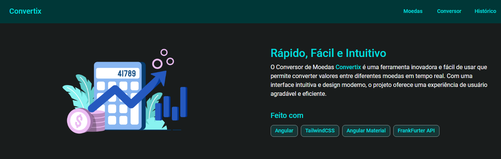

<h1 align="center">
    💻Hi, I'm Victor Jerrysson 💻
</h1>

 

## About me

`"Ok but, who is this guy?"`

    <ul align="left">
        <li>📚 Studying a bachelor's degree in Information Systems at IFCE (Instituto Federal do Ceará)</li>
        <li>🕯 23 years</li>
        <li>💻 Full stack Developer</li>
        <li>🎮 Passion for technology, games and exercises</li>
    </ul>

 

## Stats

`▶ Check out my stats`

    
    

 

### Contact:

`▶ Here's where you can find me`

<ul>
    <li>
              </li>
    <li>
        
    </li>
    <li>
        
    </li>
</ul>

  
 
## Techs Experience

`▶ Here's some of my tricks`

### Frontend

  
  -
  
  -
  
  -
  
  -
  
  -
  
  -
  
  -
  
  -
  
  -
  

### Backend

    
    -
    
    -
    
    -
    
    -
    

  
### Tools

  
  -
  
  -
  
  -
  
  -
  

  
### Package managers

  
  -
  
  - 
  
  

### Database

  
  -
  

### Studying

  

 
  
## Projects

`▶ My efforts generates results`
### Fintrack: Financial manager

<ul align="left">
    <li>Repository: <a href="https://github.com/VictorJGB/fintrack" target="_blank">fintrack</a></li>
    <li>Techs:  
        <code></code>
        <code></code>
        <code></code>
        <code></code>
        <code></code>
    </li>
</ul>

### Portfolio NextJS

<ul align="left">
    <li>Repository: <a href="https://github.com/VictorJGB/portifolio-nextjs" target="_blank">portfolio-nextjs</a></li>
    <li>Live: <a href="https://portifolio-v2-roan.vercel.app" target="_blank">vercel</a></li>
    <li>Techs:  
        <code></code>
        <code></code>
        <code></code>
    </li>
</ul>

### Convertix: Coin converter

<ul align="left">
    <li>Repo: <a href="https://github.com/VictorJGB/convertix" target="_blank">Repository</a></li>
    <li>Live: <a href="https://convertix.vercel.app" target="_blank">Convertix</a></li>
    <li>Techs:  
        <code></code>
        <code></code>
        <code></code>
    </li>
</ul>

  
## Reference

### Icons

- <a href="https://github.com/alexandresanlim/Badges4-README.md-Profile" target="_blank">Badges</a>
- <a href="https://github.com/marwin1991/profile-technology-icons" target="_blank">Tech Icons</a>

### Medias

- <a href="https://github.com/Anmol-Baranwal/Cool-GIFs-For-GitHub" target="_blank">Banners</a>
- <a href="https://giphy.com/" target="_blank">GIFs</a>

## See u next time!

